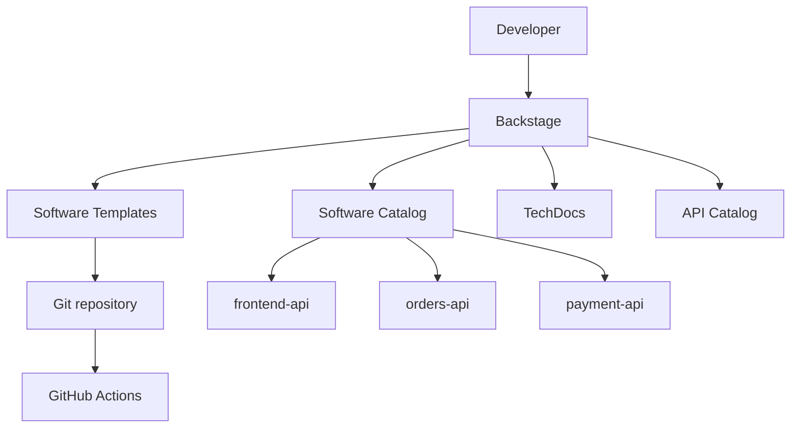

# Internal Developer Platform with Backstage

An MVP developer portal that demonstrates Platform Engineering practices with
Backstage: a software catalog, ownership, TechDocs, API contracts and a Golden
Path for Python microservices.

## Status

The portal is container-first: `docker compose up --build` starts Backstage,
PostgreSQL and Keycloak. Cloud integrations remain out of scope for this MVP.

## Planned capabilities

- Software Catalog for `frontend-api`, `orders-api`, and `payment-api`
- Domain, system, group, component, and API relationships
- TechDocs for the catalogued services
- `Create Python Microservice` software template
- Generated FastAPI service skeleton with Docker, CI, tests, documentation,
  and catalog metadata
- Local-first execution with Yarn and Docker Compose

## Architecture



Backstage is the developer portal, catalog, self-service and documentation
layer. It does not replace Git, CI/CD, Kubernetes, Terraform, observability or
cloud providers; it connects developers to those capabilities.

## Golden Path

The planned `Create Python Microservice` template asks for a service name,
description, owner and system. It creates a small FastAPI service with:

- `GET /health` and `GET /`
- tests, Dockerfile and dependency manifest
- a GitHub Actions CI workflow (lint, tests and Docker build)
- `catalog-info.yaml`, `mkdocs.yml` and starter TechDocs

This means a developer asks for a capability and receives an organization-wide
standard path instead of manually assembling repository structure, CI, Docker,
documentation and catalog metadata.

## Demo scenario

1. In Backstage, select **Create Python Microservice**.
2. Enter `inventory-api`, its description, owner and system.
3. Generate the service structure and inspect `catalog-info.yaml`.
4. Run the FastAPI service and tests.
5. Open its TechDocs from the catalog.

The local publisher writes generated services to `generated-services/` and
registers the generated `catalog-info.yaml` in the running catalog. GitHub
repository creation is intentionally optional and is not required for this
local flow.

## Roadmap

After the local MVP: GitHub repository creation and authentication, Kubernetes
and Argo CD plugins, Grafana/OpenTelemetry integration, EKS and AWS metadata,
Terraform templates, scorecards, SLO/security/cost metadata, RBAC and
production deployment.

## Planning

The approved MVP scope and staged implementation plan live in
[`docs/prd/001-backstage-idp-mvp.md`](docs/prd/001-backstage-idp-mvp.md).

## Run locally

Prerequisite: Docker Desktop (or Docker Engine with the Compose plugin) must be running.

```bash
docker compose up --build
```

The first build downloads the Backstage dependencies and can take several minutes.
When the services are ready, open `http://localhost:7007`, choose **Sign in using
Keycloak**, and use the local demo account `crilsen` / `crilsen`. Keycloak is
available at `http://localhost:8080`. These credentials and the local client
secret are for a disposable portfolio demo only; never expose this Compose
stack to a public network as-is.

Run in the background with `make up` (or `docker compose up --build -d`), inspect
logs with `make logs`, and stop the environment with `make down`. To remove the
local persisted data as well, run `make clean` (destructive).

The Compose stack contains:

- `backstage`: the portal, catalog, Scaffolder and TechDocs backend on port 7007;
- `postgres`: the Backstage database, persisted in the `postgres-data` Docker volume;
- `keycloak`: local identity provider on port 8080, persisted in `keycloak-data`.

`make down` stops containers without deleting the database or Keycloak realm.
`make up` starts them again. Generated TechDocs files are persisted in the
`techdocs-data` volume. The Markdown source stays versioned in `docs/services/`.

All runtime dependencies are containerized. Node and Yarn are only needed when
developing the Backstage source outside the container.

### Persistence

The Compose file declares three named volumes:

| Volume | Stores | Removed by |
| --- | --- | --- |
| `postgres-data` | Catalog, Scaffolder and Backstage plugin data | `make clean` |
| `keycloak-data` | Realm, users and login configuration | `make clean` |
| `techdocs-data` | Generated TechDocs output | `make clean` |

`make down` preserves these volumes. Use `make clean` only when intentionally
resetting the demo environment.

### Useful commands

```bash
make install  # build the container image
make up       # build and start in background
make logs     # follow all service logs
make down     # stop containers and preserve data
make clean    # stop and delete volumes
```

To run the generated service independently after creating it:

```bash
docker compose -f generated-services/inventory-api/compose.yaml up --build
```

The generated service exposes `GET /health` and `GET /` on port 8000.

### Troubleshooting

- **Docker socket unavailable:** start Docker Desktop, confirm `docker info`
  works, then retry `make up`.
- **Port 7007 or 8080 already in use:** stop the process/container using the
  port, or change the host-side port mapping in `docker-compose.yml`.
- **Login fails after changing Keycloak data:** run `make clean` and `make up`
  to re-import the disposable realm and demo user.
- **Catalog still shows an old entity:** restart the stack with `make down`
  followed by `make up`; static catalog locations may be cached by Backstage.
- **Template output already exists:** remove only the generated test directory
  `generated-services/inventory-api` and run the template again.

The Keycloak account `crilsen/crilsen`, client secret and local admin account
`admin/admin` are demo credentials. Do not reuse them outside this local
portfolio environment.
